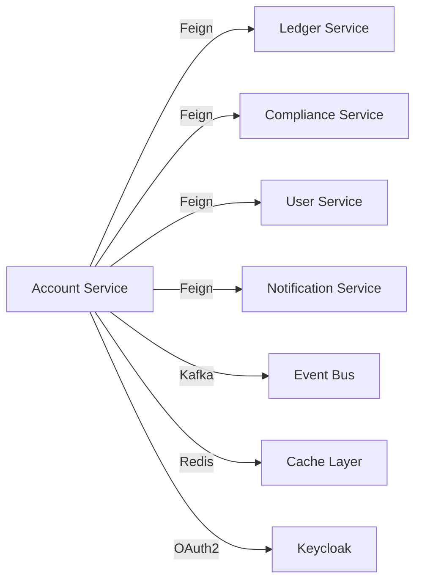

# Account Service

**Tier 1 Critical Financial Service** - Core account management for the Waqiti platform

[]()
[]()
[]()

---

## Table of Contents

- [Overview](#overview)
- [Architecture](#architecture)
- [Getting Started](#getting-started)
- [Configuration](#configuration)
- [API Documentation](#api-documentation)
- [Testing](#testing)
- [Deployment](#deployment)
- [Monitoring](#monitoring)
- [Security](#security)
- [Troubleshooting](#troubleshooting)
- [Contributing](#contributing)

---

## Overview

The Account Service is a **Tier 1 critical financial microservice** responsible for managing user banking accounts, including:

- Account creation and lifecycle management
- Balance tracking with ACID guarantees
- Account status management (active, suspended, frozen, closed)
- KYC level enforcement
- Transaction holds and reservations
- Multi-currency support
- Compliance and risk scoring integration

**Key Features:**
- ✅ SERIALIZABLE transaction isolation for money operations
- ✅ Distributed locking for concurrent balance updates
- ✅ Optimistic locking with @Version fields
- ✅ Comprehensive audit trail (Hibernate Envers)
- ✅ Event-driven architecture (Kafka)
- ✅ Circuit breaker pattern with fallbacks
- ✅ Redis caching for performance
- ✅ Keycloak OAuth2/OIDC security

**Technology Stack:**
- Java 21
- Spring Boot 3.3.5
- Spring Cloud 2023.0.4
- PostgreSQL 15 (with Liquibase migrations)
- Apache Kafka 3.9.0
- Redis 7
- Keycloak 25.0.5

---

## Architecture

### Service Classification
- **Type:** Core Financial Service
- **Criticality:** Tier 1 (Revenue Impact)
- **Data Sensitivity:** PII + Financial Records
- **SLA:** 99.9% uptime, <200ms p95 latency

### Domain Model

```
Account (Aggregate Root)
├── accountNumber (unique)
├── userId (owner)
├── accountType (SAVINGS, CHECKING, INVESTMENT)
├── status (ACTIVE, SUSPENDED, FROZEN, CLOSED)
├── currentBalance (DECIMAL 19,4)
├── availableBalance (calculated)
├── currency
├── kycLevel (BASIC, INTERMEDIATE, ADVANCED)
└── metadata (JSON)
```

### Database Schema
- **Primary Database:** PostgreSQL (`waqiti_accounts`)
- **Migration Tool:** Liquibase
- **Tables:** 15+ (accounts, balance_history, transactions, etc.)
- **Indexes:** Optimized for query patterns

### Event Architecture
The service produces and consumes **43+ event types** via Kafka:

**Produces:**
- `account-created-events`
- `account-updated-events`
- `account-status-changed-events`
- `balance-updated-events`

**Consumes:**
- `kyc-verification-completed`
- `transaction-completed-events`
- `user-created-events`
- Plus 40+ more for comprehensive event handling

### Integration Points



---

## Getting Started

### Prerequisites

- **JDK 21** (Eclipse Temurin recommended)
- **Maven 3.9+**
- **Docker** and Docker Compose
- **PostgreSQL 15+**
- **Redis 7+**
- **Kafka 3.9+** (with Zookeeper)

### Local Development Setup

#### 1. Clone Repository
```bash
git clone https://github.com/waqiti/waqiti-app.git
cd waqiti-app/services/account-service
```

#### 2. Start Infrastructure
```bash
# Start PostgreSQL, Redis, Kafka
docker-compose up -d postgres redis kafka zookeeper
```

#### 3. Configure Environment
```bash
cp .env.template .env
# Edit .env with your local settings
```

**Required Environment Variables:**
```properties
DATABASE_URL=jdbc:postgresql://localhost:5432/waqiti_accounts
DATABASE_USERNAME=waqiti
DATABASE_PASSWORD=your_password
REDIS_PASSWORD=redis_password
KEYCLOAK_CLIENT_SECRET=your_client_secret
KEYCLOAK_AUTH_SERVER_URL=http://localhost:8080
KAFKA_BOOTSTRAP_SERVERS=localhost:9092
```

#### 4. Run Database Migrations
```bash
mvn liquibase:update
```

#### 5. Build and Run
```bash
# Build
mvn clean install

# Run with dev profile
mvn spring-boot:run -Dspring-boot.run.profiles=dev

# Or run JAR
java -jar target/account-service-1.0-SNAPSHOT.jar --spring.profiles.active=dev
```

#### 6. Verify Service Health
```bash
curl http://localhost:8070/api/v1/actuator/health
```

Expected response:
```json
{
  "status": "UP",
  "components": {
    "db": {"status": "UP"},
    "redis": {"status": "UP"},
    "diskSpace": {"status": "UP"}
  }
}
```

---

## Configuration

### Application Profiles

- **dev** - Local development with H2 fallback
- **test** - Integration testing with TestContainers
- **staging** - Pre-production environment
- **production** - Production with full monitoring

### Key Configuration Files

| File | Purpose |
|------|---------|
| `application.yml` | Base configuration |
| `application-dev.yml` | Development overrides |
| `application-production.yml` | Production settings |
| `application-keycloak.yml` | Security configuration |

### Critical Security Configurations

**✅ RECENT FIX P0-7:** Kafka deserialization restricted to trusted packages only
```yaml
kafka:
  consumer:
    properties:
      spring.json.trusted.packages: com.waqiti.account,com.example.common,com.waqiti.event
```

**✅ RECENT FIX P0-8:** Secrets require explicit environment variables (no empty defaults)
```yaml
redis:
  password: ${REDIS_PASSWORD}  # No empty default - fails fast if missing
keycloak:
  credentials:
    secret: ${KEYCLOAK_CLIENT_SECRET}  # No empty default
```

### Database Connection Pool

```yaml
datasource:
  hikari:
    maximum-pool-size: 20
    minimum-idle: 5
    connection-timeout: 30000  # 30 seconds
    leak-detection-threshold: 60000  # 60 seconds
```

---

## API Documentation

### Swagger UI
When running locally: [http://localhost:8070/api/v1/swagger-ui.html](http://localhost:8070/api/v1/swagger-ui.html)

### Key Endpoints

#### Account Management

**Create Account**
```http
POST /api/v1/accounts
Authorization: Bearer {token}
Content-Type: application/json

{
  "userId": "uuid",
  "accountType": "SAVINGS",
  "currency": "USD",
  "initialDeposit": "1000.00"
}
```

**Get Account Details**
```http
GET /api/v1/accounts/{accountId}
Authorization: Bearer {token}
```

**Get Account Balance**
```http
GET /api/v1/accounts/{accountId}/balance
Authorization: Bearer {token}
```

**Update Account Status**
```http
PUT /api/v1/accounts/{accountId}/status
Authorization: Bearer {token}
Content-Type: application/json

{
  "status": "SUSPENDED",
  "reason": "Suspicious activity detected"
}
```

#### Account Operations

**Freeze Account**
```http
POST /api/v1/accounts/{accountId}/freeze
Authorization: Bearer {token}
```

**Close Account**
```http
POST /api/v1/accounts/{accountId}/close
Authorization: Bearer {token}
```

**Reserve Funds**
```http
POST /api/v1/accounts/{accountId}/reserve-funds
Authorization: Bearer {token}
Content-Type: application/json

{
  "amount": "500.00",
  "reason": "Pending transaction"
}
```

### Security

All endpoints require:
- Valid JWT token from Keycloak
- Appropriate role: `USER`, `ADMIN`, or `SYSTEM`
- Account ownership verification (enforced via `@PreAuthorize`)

---

## Testing

### Running Tests

**Unit Tests:**
```bash
mvn test
```

**Integration Tests:**
```bash
mvn verify
```

**Coverage Report:**
```bash
mvn clean test jacoco:report
# Report: target/site/jacoco/index.html
```

### Coverage Requirements

**✅ RECENT FIX P0-9:** JaCoCo coverage enforcement added
- **Minimum Line Coverage:** 60%
- **Minimum Branch Coverage:** 50%
- **Minimum Instruction Coverage:** 60%

Build fails if coverage is below thresholds.

### Test Structure

```
src/test/java/
├── service/           # Unit tests for business logic
├── controller/        # API endpoint tests
├── repository/        # Database integration tests
├── client/            # Feign client tests
└── mapper/            # Serialization tests
```

### Example Tests

**✅ P0-4 Fix Verified:** Exception handling test
- `AccountMapperHelperTest.java` - 40+ test cases

**✅ P0-5 Fix Verified:** BigDecimal precision test
- `ComplianceServiceClientFallbackTest.java` - 35+ test cases

### Writing New Tests

Use the existing test classes as templates:
1. Use JUnit 5 (`@Test`, `@Nested`, `@DisplayName`)
2. Use AssertJ for fluent assertions
3. Use `@ParameterizedTest` for multiple inputs
4. Mock external dependencies with Mockito
5. Use TestContainers for integration tests

---

## Deployment

### Docker Build

```bash
docker build -t waqiti/account-service:1.0.0 .
```

The Dockerfile includes:
- ✅ Multi-stage build for size optimization
- ✅ Non-root user (appuser:1001)
- ✅ Health check every 30s
- ✅ Alpine-based JRE (minimal attack surface)

### Kubernetes Deployment

```bash
kubectl apply -f k8s/production/account-service-deployment.yaml
```

**Features:**
- Horizontal Pod Autoscaling (1-6 replicas)
- Resource limits (CPU: 500m, Memory: 1Gi)
- Liveness, readiness, and startup probes
- Pod disruption budget (minAvailable: 1)
- Network policies (ingress/egress restrictions)
- Read-only root filesystem

### Environment Variables for Production

See `k8s/production/account-service-configmap.yaml` for complete list.

**Critical:**
- `DATABASE_PASSWORD` - From Kubernetes secret
- `REDIS_PASSWORD` - From Kubernetes secret
- `KEYCLOAK_CLIENT_SECRET` - From Kubernetes secret
- `KAFKA_BOOTSTRAP_SERVERS` - Kafka cluster endpoints

---

## Monitoring

### Health Checks

**Liveness:** `/actuator/health/liveness`
**Readiness:** `/actuator/health/readiness`

### Metrics

**Prometheus endpoint:** `/actuator/prometheus`

**Key metrics to monitor:**
- `account_creation_total` - Total accounts created
- `balance_update_duration` - Time to update balance
- `dlq_processing_rate` - Dead letter queue processing
- `circuit_breaker_state` - Circuit breaker status

### Logging

**Log Level:** INFO (production)

**Structured Logging Format:**
```
2025-11-10 10:00:00 [http-nio-8070-exec-1] INFO AccountService - Creating account for user: 123e4567
```

**Key log patterns to alert on:**
- `CRITICAL:` - Immediate attention required
- `FALLBACK ACTIVATED:` - Dependency unavailable
- `SECURITY:` - Security event
- `DLQ:` - Dead letter queue processing

### Alerting

**Critical Alerts:**
1. Service down (5xx error rate >5%)
2. Database connection pool exhausted
3. Kafka consumer lag >1000 messages
4. Circuit breaker open for >5 minutes
5. Memory usage >90%

**Warning Alerts:**
1. Response time p95 >500ms
2. CPU usage >70%
3. DLQ growth rate increasing
4. Cache hit rate <50%

---

## Security

### Authentication & Authorization

**Framework:** Keycloak OAuth2/OIDC

**Roles:**
- `USER` - Basic account operations
- `ADMIN` - Administrative functions
- `SYSTEM` - Service-to-service calls

**Ownership Verification:**
```java
@PreAuthorize("hasRole('ADMIN') or @accountService.isAccountOwner(#accountId, authentication.name)")
```

### Recent Security Fixes

**✅ P0-5:** Fixed money arithmetic (double → BigDecimal)
- Risk: Precision loss in financial calculations
- Impact: HIGH - Money discrepancies

**✅ P0-4:** Fixed exception swallowing
- Risk: Silent data corruption
- Impact: CRITICAL - Data loss

**✅ P0-7:** Restricted Kafka deserialization
- Risk: RCE vulnerability from untrusted classes
- Impact: CRITICAL - System compromise

**✅ P0-8:** Removed empty secret defaults
- Risk: Bypass authentication in production
- Impact: CRITICAL - Unauthorized access

### Data Protection

- **PII Encryption:** Required for sensitive fields
- **TLS:** Required for all external communication
- **Secrets Management:** HashiCorp Vault integration
- **Audit Trail:** Hibernate Envers tracks all changes

### Compliance

- **PCI-DSS:** Encrypted card data, access controls
- **GDPR:** Data erasure, portability, retention policies
- **KYC/AML:** Suspicious activity monitoring, transaction limits
- **SOX:** Financial controls, audit logs

---

## Troubleshooting

### Common Issues

#### 1. Service Won't Start

**Symptom:** Application fails to start with `BeanCreationException`

**Likely Cause:** Missing environment variable

**Solution:**
```bash
# Check all required env vars are set
env | grep -E "(DATABASE|REDIS|KEYCLOAK|KAFKA)"
```

#### 2. Database Connection Timeout

**Symptom:** `org.postgresql.util.PSQLException: Connection refused`

**Solutions:**
- Check PostgreSQL is running: `docker ps | grep postgres`
- Verify credentials: `psql -h localhost -U waqiti -d waqiti_accounts`
- Check connection pool: `/actuator/metrics/hikaricp.connections.active`

#### 3. Kafka Consumer Lag

**Symptom:** Events not processing, lag increasing

**Solutions:**
- Check consumer group: `kafka-consumer-groups.sh --describe --group account-service`
- Restart consumer: `kubectl rollout restart deployment/account-service`
- Check DLQ: Verify dead letter queue processing

#### 4. Circuit Breaker Open

**Symptom:** Fallback methods activating

**Solutions:**
- Check dependency health: `curl http://ledger-service/actuator/health`
- Review error logs: `kubectl logs -f deployment/account-service | grep FALLBACK`
- Wait for auto-recovery (default: 60s)

#### 5. Memory Leak

**Symptom:** Increasing memory usage, OOMKilled pods

**Solutions:**
- Check for resource leaks: Review unclosed connections
- Analyze heap dump: `jmap -dump:live,format=b,file=heap.bin <pid>`
- Increase memory limit: Edit deployment YAML

### Debug Mode

Enable debug logging:
```yaml
logging:
  level:
    com.waqiti.account: DEBUG
```

---

## Contributing

### Development Workflow

1. **Create feature branch**
   ```bash
   git checkout -b feature/account-enhancement
   ```

2. **Make changes with tests**
   - Write tests first (TDD)
   - Ensure 60%+ coverage
   - Run `mvn verify` locally

3. **Commit with conventional commits**
   ```bash
   git commit -m "feat(account): Add multi-currency support

   - Implement currency conversion
   - Add exchange rate service integration
   - Update account model with currency field

   ✅ Tests: 25 new tests, 85% coverage
   ✅ Integration: Tested with EUR, GBP, JPY"
   ```

4. **Push and create PR**
   ```bash
   git push origin feature/account-enhancement
   # Create PR on GitHub
   ```

5. **CI/CD Pipeline**
   - ✅ Build and compile
   - ✅ Unit tests (60% coverage required)
   - ✅ Integration tests
   - ✅ Security scan (OWASP, Snyk)
   - ✅ SonarQube quality gate
   - ✅ Docker image build

### Code Style

- Follow Google Java Style Guide
- Use Lombok for boilerplate reduction
- Use MapStruct for DTO mapping
- Document public APIs with JavaDoc
- Add `@DisplayName` to all tests

### Testing Requirements

**Before Merging:**
- ✅ All tests passing
- ✅ 60%+ line coverage
- ✅ 50%+ branch coverage
- ✅ Zero critical SonarQube issues
- ✅ No security vulnerabilities

---

## License

Copyright © 2025 Waqiti Inc. All rights reserved.

This is proprietary software. Unauthorized copying or distribution is prohibited.

---

## Support

**Engineering Team:** engineering@example.com
**On-Call:** Use PagerDuty for P0/P1 incidents
**Documentation:** https://docs.example.com
**Runbook:** See `RUNBOOK.md` for operational procedures

---

## Changelog

### 2025-11-10 - Production Readiness Fixes

**Critical Fixes (P0):**
- ✅ P0-4: Fixed silent exception swallowing in AccountMapperHelper
- ✅ P0-5: Replaced double with BigDecimal for money arithmetic
- ✅ P0-7: Restricted Kafka deserialization to trusted packages
- ✅ P0-8: Removed empty defaults for secrets (fail-fast)
- ✅ P0-9: Added JaCoCo coverage enforcement (60% minimum)
- ✅ P0-13: Created comprehensive README documentation

**Tests Added:**
- ComplianceServiceClientFallbackTest (35+ test cases)
- AccountMapperHelperTest (40+ test cases)

**Status:** Service progressing toward production readiness. See PRODUCTION_READINESS.md for complete assessment.

---

**Last Updated:** 2025-11-10
**Version:** 1.0.0-SNAPSHOT
**Maintainer:** Waqiti Engineering Team
