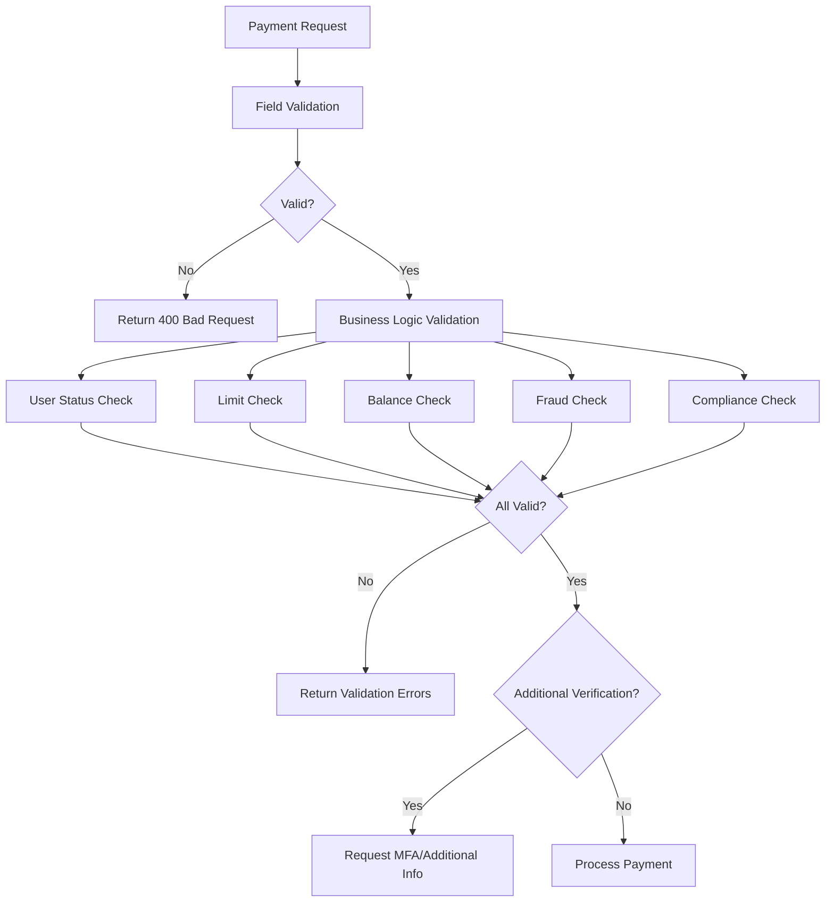

# Payment Validation Guide

## Overview
This guide describes the comprehensive payment validation framework implemented in the Waqiti payment service. The framework provides multiple layers of validation to ensure payment security, compliance, and data integrity.

## Validation Layers

### 1. Field-Level Validation (Bean Validation)
Basic validation using JSR-303 annotations on DTOs.

```java
@NotNull(message = "Amount is required")
@ValidPaymentAmount(min = 0.01, max = 1000000.00)
private BigDecimal amount;

@ValidCurrency(supported = {"USD", "EUR", "GBP"})
private String currency;
```

### 2. Custom Validators
Specialized validators for payment-specific fields:

- **PaymentAmountValidator**: Validates amounts based on payment type, checks for suspicious patterns
- **IBANValidator**: Full IBAN validation with checksum verification
- **CardNumberValidator**: Luhn algorithm validation, card type detection, test card blocking
- **CurrencyValidator**: Supported currency validation
- **RoutingNumberValidator**: US bank routing number validation
- **SwiftCodeValidator**: SWIFT/BIC code format validation
- **CryptoAddressValidator**: Cryptocurrency address validation by type

### 3. Cross-Field Validation
Validation that depends on multiple fields:

```java
@AssertTrue(message = "Card details required for card payments")
private boolean isCardDetailsValid() {
    if ("CREDIT_CARD".equals(paymentMethod)) {
        return cardNumber != null && cvv != null;
    }
    return true;
}
```

### 4. Business Logic Validation
Complex validation in `PaymentValidationService`:

- User status and permissions
- Payment limits (daily, monthly, per-transaction)
- Balance verification
- Duplicate payment detection
- Fraud risk assessment
- Compliance checks
- Business rules

## Validation Flow



## Usage Examples

### 1. Basic Payment Validation

```java
@PostMapping("/payments")
public ResponseEntity<?> createPayment(@Valid @RequestBody EnhancedPaymentRequest request) {
    // Field validation happens automatically via @Valid
    
    // Business logic validation
    ValidationResult result = validationService.validatePaymentRequest(request);
    
    if (!result.isValid()) {
        return ResponseEntity.badRequest().body(result.getErrors());
    }
    
    if (result.isRequiresAdditionalVerification()) {
        return ResponseEntity.status(HttpStatus.ACCEPTED)
            .body(new VerificationRequiredResponse(result.getWarnings()));
    }
    
    // Process payment
    return paymentService.processPayment(request);
}
```

### 2. High-Value Payment with Enhanced Validation

```java
EnhancedPaymentRequest request = EnhancedPaymentRequest.builder()
    .senderId(userId)
    .recipientIdentifier(recipientId)
    .amount(new BigDecimal("50000.00"))
    .currency("USD")
    .paymentMethod("WIRE")
    .sourceOfFunds("Business income") // Required for high-value
    .beneficiaryName("John Doe")      // Required for wire
    .beneficiaryAddress("123 Main St, New York, NY")
    .build();
```

### 3. International Transfer Validation

```java
EnhancedPaymentRequest request = EnhancedPaymentRequest.builder()
    .senderId(userId)
    .amount(new BigDecimal("1000.00"))
    .currency("EUR")
    .paymentMethod("BANK_ACCOUNT")
    .iban("DE89370400440532013000")      // Validated with checksum
    .swiftCode("DEUTDEFF")                // Required with IBAN
    .beneficiaryName("Hans Mueller")      // Required
    .beneficiaryAddress("Berlin, Germany") // Required
    .purposeOfPayment("Family support")    // Recommended
    .build();
```

## Validation Rules by Payment Type

### Standard Payments
- Amount: $0.01 - $10,000
- Recipient: Any verified user
- Methods: Wallet, debit card
- Additional verification: For amounts > $5,000

### High-Value Payments
- Amount: $10,000 - $1,000,000
- Requires: Source of funds declaration
- Methods: Wire transfer, bank account
- Additional verification: Always required
- Compliance: CTR filing for amounts >= $10,000

### International Payments
- Amount: $100 - $50,000
- Requires: Beneficiary details, purpose of payment
- Methods: SWIFT wire, international card
- Validation: IBAN/SWIFT codes, sanctions screening
- Restrictions: High-risk countries blocked

### Crypto Payments
- Amount: 0.0001 - 100,000 (in crypto units)
- Requires: Valid wallet address for specific crypto
- Validation: Address format by crypto type
- Additional: Network confirmation required

## Error Response Format

```json
{
  "valid": false,
  "requiresAdditionalVerification": false,
  "errors": [
    {
      "code": "INSUFFICIENT_BALANCE",
      "message": "Insufficient balance. Required: 105.00, Available: 50.00"
    }
  ],
  "warnings": [
    {
      "code": "HIGH_VELOCITY",
      "message": "High number of recent transactions detected"
    }
  ],
  "info": [
    {
      "code": "CURRENCY_CONVERSION",
      "message": "Currency conversion will be applied at current market rate"
    }
  ]
}
```

## Security Considerations

1. **PCI Compliance**: Card numbers are never logged or stored unencrypted
2. **Sensitive Data**: CVV is never stored, only used for immediate validation
3. **Rate Limiting**: Payment endpoints have strict rate limits
4. **Audit Trail**: All validation failures are logged for security analysis
5. **Fraud Patterns**: Machine learning models detect suspicious patterns

## Adding Custom Validations

### 1. Create Custom Annotation

```java
@Target({ElementType.FIELD})
@Retention(RetentionPolicy.RUNTIME)
@Constraint(validatedBy = MyCustomValidator.class)
public @interface MyCustomValidation {
    String message() default "Custom validation failed";
    Class<?>[] groups() default {};
    Class<? extends Payload>[] payload() default {};
}
```

### 2. Implement Validator

```java
public class MyCustomValidator implements ConstraintValidator<MyCustomValidation, String> {
    @Override
    public boolean isValid(String value, ConstraintValidatorContext context) {
        // Validation logic
        return true;
    }
}
```

### 3. Apply to DTO Field

```java
@MyCustomValidation
private String customField;
```

## Testing Validations

```java
@Test
public void testHighValuePaymentValidation() {
    EnhancedPaymentRequest request = createHighValueRequest();
    request.setSourceOfFunds(null); // Missing required field
    
    Set<ConstraintViolation<EnhancedPaymentRequest>> violations = 
        validator.validate(request);
    
    assertThat(violations).hasSize(1);
    assertThat(violations.iterator().next().getMessage())
        .isEqualTo("Source of funds required for high-value payments");
}
```

## Performance Considerations

1. **Parallel Validation**: Business logic validations run in parallel
2. **Caching**: User status and limits are cached for performance
3. **Database Queries**: Optimized with proper indexes
4. **Fail Fast**: Validation stops at first critical error

## Monitoring and Alerts

- Validation failure rates tracked in metrics
- Alerts for unusual validation patterns
- Fraud detection integration for real-time monitoring
- Compliance reporting for regulatory requirements